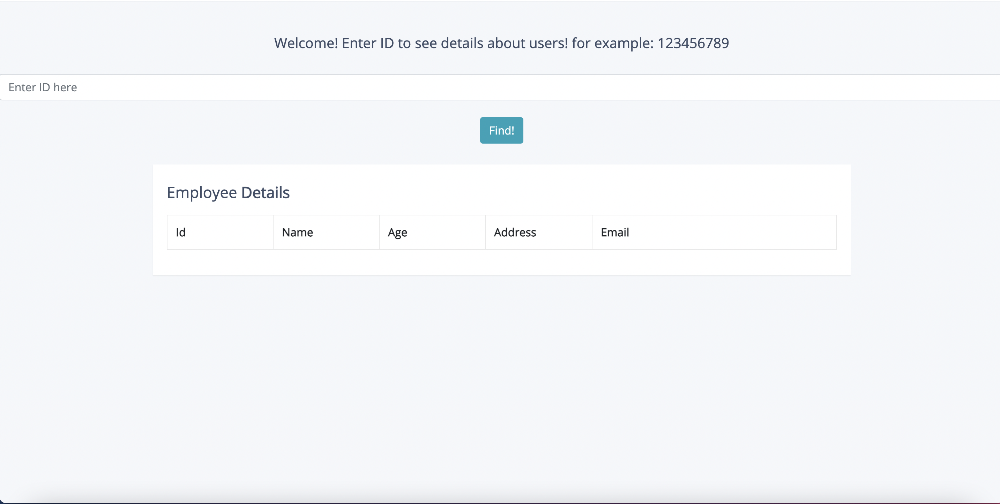
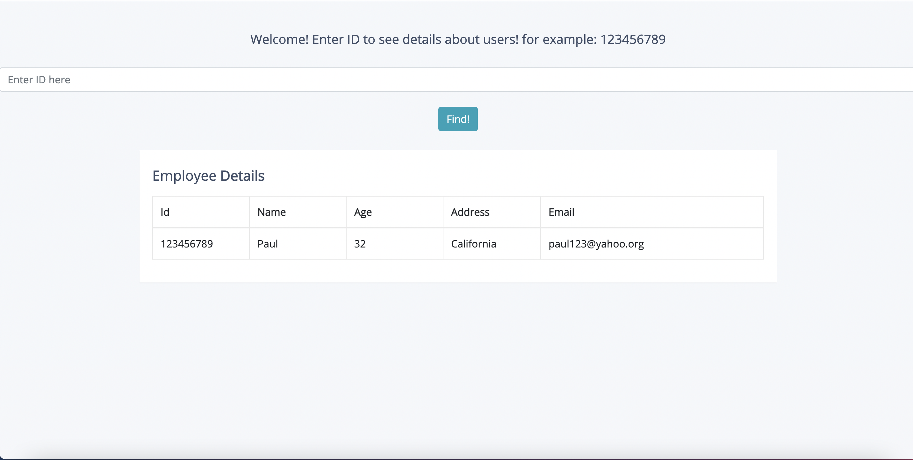
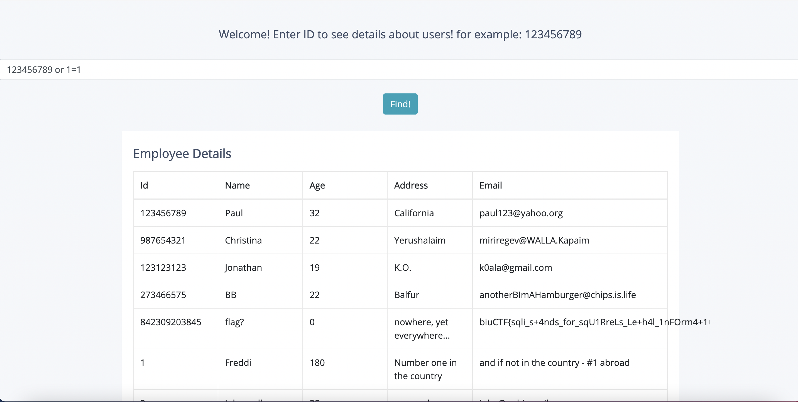

# SquirrelsDB - biuCTF2021
## WriteUp By Dirty Cow

Let's Start. We got a link: http://challenges.ctf.cs.biu.ac.il:7006/

let's press the link and see what we get:

 

So we have a search bar. We can input *123456789* and get the user with ID 123456789:

 

So we can search for users and get information about them. The flag is probably somewhere in the database, but we 
don't know where. So our only option is to print the whole database.

We can assume that the data is stored using SQL, so we will exploit the database using SQL injection. 
The command for searching a user should be in the following format:
```
SELECT * FROM users where ID = {entered_id}
```

We can exploit the condition. instead of ```where ID = {entered id}``` we want ```where ID = entered_id or 1=1```,
causing all of the users to be returned. 
So we can simply enter 
```123456789 or 1=1``` 
and that should do the job.
Let's enter the expression, and voila:

 


We found the flag, which is ```biuCTF{sqli_s+4nds_for_sqU1RreLs_Le+h4l_1nFOrm4+1On}```
