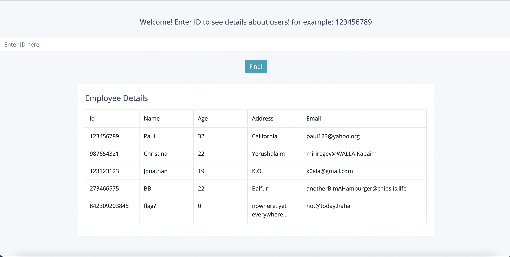
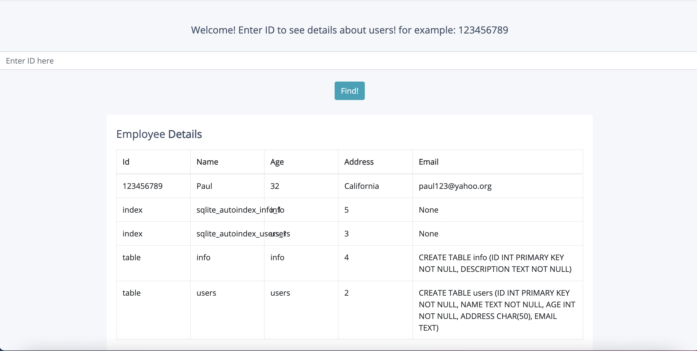
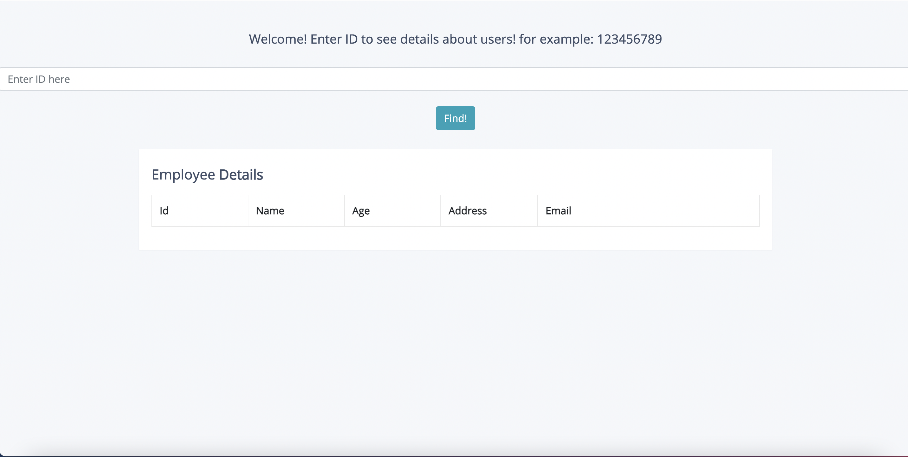
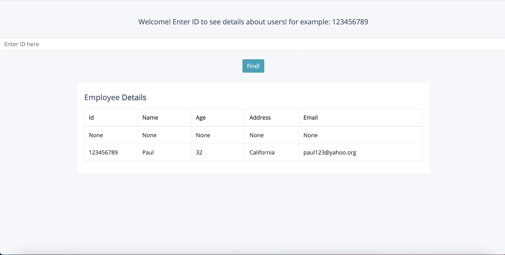

# SquirrelsDB 2.0 - biuCTF2021

Let's Start. We got a link: http://challenges.ctf.cs.biu.ac.il:7007/

let's press the link ,and what we get a page that looks
Similar to the previous challenge. If we input ```123456789 or 1=1``` like before, we'll get:

 

The flag isn't here. So it's probably somewhere else in the database. We know this databse is a sqlite databse, so we 
can use the command ```SELECT * FROM sqlite_master``` to print info about all the tables in the database. 
We can inject the command by writing ```123456789 UNION SELECT * FROM sqlite_master```, this will result in the command:
```
SELECT * FROM users WHERE ID=id UNION SELECT * FROM sqlite_master
```
So we should get the user with id 123456789, and information about the tables in the databse. and behold:

 

we can see that there is a table called ```info```. The flag isn't in the users table so it has to be in info.
Let's try to print the table by injecting ```SELECT * FROM info```:

 

Hmmmm. There is no data. That could be because some of the rows contain NULL in them.

So if we Inject ```SELECT null,null,null,null,null FROM info```:

 


we get data from the table (but not the flag). So we know the table has 5 columns and 2 of them 
are ID and DESCRIPTION (we know that from the *sqlite_master* command).

So we can try ```SELECT ID,DESCRIPTION,null,null,null FROM info```. But we get nothing.
Let's try ```SELECT null,ID,DESCRIPTION,null,null FROM info```. And voila:

 

We found the flag, which is ```biuCTF{uN1Te_4g41nSt_THE_SQu1rRELs_un1oN}```

