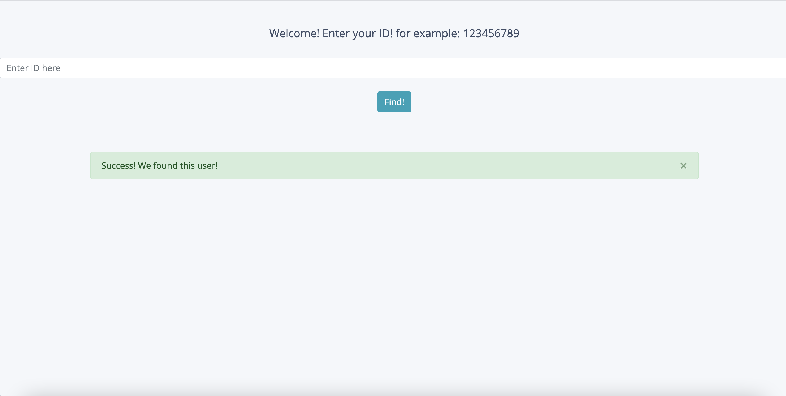

# SquirrelsDB 3.0 - biuCTF2021

Let's Start. We got a link: http://challenges.ctf.cs.biu.ac.il:7008/

let's press the link ,and we get a page that looks
similar to the previous challenge. If we input ```123456789```, we can see that we don't get info about the user - 
we just get an indication if the user is in the databse.

 

Hmmm... so how can we get the flag if it can't be printed to us?

Well, we can look at it this way - if we have the flag, can we check if it indeed exists in a column in the database?
In SQL, we can check if a query resulted in an answer with the ```EXISTS``` Command.
If the flag exists in the table - where will it be? It probably won't be in the ID column (because that is a number, and frankly 
the id of the user that we are looking for is given to us - *10210897103*), 
so we can assume it is in the EMAIL column (which we know exists from the clue).
So, if we guess a flag, to check if it exists in the database we can use
```
EXISTS(SELECT * FROM users WHERE Id=10210897103 AND EMAIL=guessed_flag)
```

and to inject the command, we will type
```
121212 or EXISTS(SELECT * FROM users WHERE Id=10210897103 AND EMAIL=guessed_flag)
```
Because we know that 121212 is not in the databse for sure.

This is all lovely, however we are not bored. we won't type all the possibilities.
But what we can do, is use the SQL function ```substr()```.
If check ```substr(EMAIL, x, 1) = guess``` Then we can find the character at index x of the flag in 256 checks (number of ascii chars).
So if we assume the flag is about 30 chars long, it will. take us 30*256 = 7680* checks. An improvement, but still too much.
So how can we make the search faster? Well the answer, of course, is *Binary Search*.
If we do ```substr(EMAIL, x, 1) < guess``` where guess is the middle of the ascii chars which are left, we can find the
character at index x of the flag in log(256)= 8 checks.
And of coure the *biuCTF{}* characters we don't need to find, so finding the dlag will take in total about 20*8=160 checks.

So using the command
```
121212 or EXISTS(SELECT * FROM users WHERE Id=10210897103 AND substr(EMAIL, x, 1) < guess)
```
160 times (it actually ends up less because most of the characters are letters), we can find the flag which is

```
biuCTF{4r3_y0u_LIKE_bl1nd?!}
```

